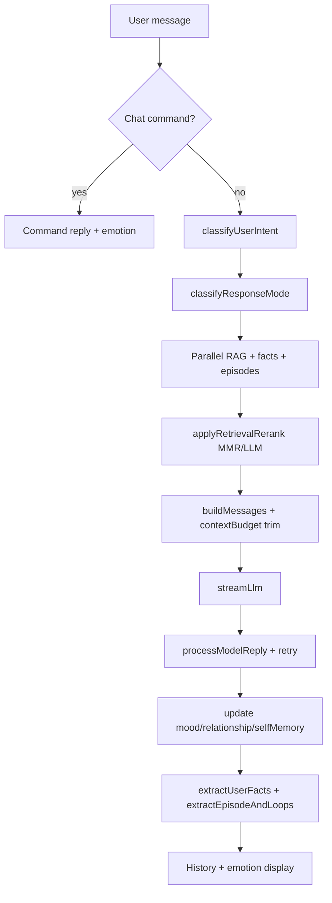
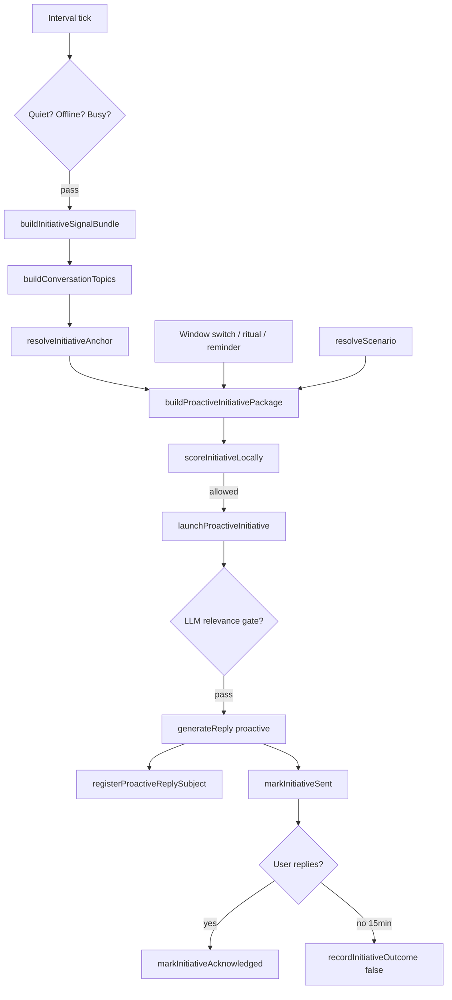

# Architecture

## Stack

| Layer | Technology |
|-------|------------|
| Shell | Tauri 2 (Rust backend, Windows) |
| UI | React 19 + TypeScript |
| Build | Vite 7 |
| LLM | Ollama (local) or GigaChat REST API |
| Storage | localStorage, IndexedDB, Windows DPAPI |

## Process model

- **Window**: transparent, always-on-top, draggable/resizable; position persisted in `desktop-character.window-layout.v1`.
- **Tray**: minimize hides to tray; left-click toggles visibility; second instance focuses existing window.
- **Autostart**: optional Windows autostart via Tauri plugin.
- **Shutdown**: red power button saves history, stops generation, terminates Ollama trees, exits fully.

## Module map

| Folder | Purpose |
|--------|---------|
| `src/app/` | React UI: `App`, `ChatPanel`, `SettingsPanel`, `MemoryPanel`, `AriTaskBoard`, `Avatar`, onboarding |
| `src/chat/` | Chat history, commands, context trim/budget, capabilities overview |
| `src/character/` | Mood, relationship, initiative, scenarios, presence, voice, pomodoro, focus |
| `src/llm/` | Ollama/GigaChat clients, streaming, vision, embeddings, model routing |
| `src/memory/` | User facts, episodes, RAG hooks, retrieval, telemetry, inbox, reviews |
| `src/rag/` | Document chunking, embedding, IndexedDB vector store, PDF extraction |
| `src/tasks/` | Unified task store and migration from legacy backlog |
| `src/tools/` | Safe actions, live web tools |
| `src/platform/` | Tauri bridge: window, backup, autostart, screen capture, git, credentials |
| `src/settings/` | `AppSettings` load/save and defaults |
| `src/types/` | Shared TypeScript types |

## Chat turn lifecycle

## Initiative loop

All LLM proactive paths (check-in, advisor, memory callback, tasks, distraction, PC reactions) share the same package: signal block, practical advice rule, liveliness hints, anchor, and banned-topic list before `generateReply`. Advice/smalltalk arbitration is centralized in `proactiveEngine.ts`: smalltalk keeps its existing cadence path, while advice can preempt when actionable work signals are starved.

The advisor does not store raw keyboard input. It can record aggregate `input_friction` signals only: long pauses, rapid returns, and long active dwell in an allowed coding window. These signals contain window/file metadata and numeric timings, never typed characters.

App-initiated speech (PC reactions, scenario initiatives, avatar menu) uses [`proactiveBridge.ts`](src/character/proactiveBridge.ts): enqueue from `App.tsx`, drain in `ChatPanel` → `buildProactiveInitiativePackage` → `launchProactiveInitiative`.

## Storage map

### localStorage (selected keys)

| Key | Content |
|-----|---------|
| `desktop-character.settings.v1` | App settings |
| `desktop-character.chat-history.v1` | Chat messages |
| `desktop-character.ari-mood.v1` | Mood axes |
| `desktop-character.ari-mood-engine.v2` | Mood engine vector + last classification |
| `desktop-character.ari-relationship.v1` | Bond state |
| `desktop-character.tasks.v1` | Unified tasks |
| `desktop-character.initiative-daily.v1` | Daily initiative count |
| `desktop-character.initiative-adaptive.v1` | Adaptive weights |
| `desktop-character.activity-signals.v1` | Clipboard/file/query/error signals plus aggregate `input_friction` timings |
| `desktop-character.emotion-history.v1` | Recent emotions |
| `desktop-character.retrieval-telemetry.v1` | Last 12 retrieval passes |
| `desktop-character.scenario-times.v1` | Scenario cooldowns |

### IndexedDB

| Database | Store | Content |
|----------|-------|---------|
| `ari-memory` | facts, summaries | User memory |
| `ari-episodes` | episodes | Episodic memory |
| `ari-rag` | chunks | RAG vectors + text |
| `ari-memory-embeddings` | entries | Fact/episode embeddings |
| `ari-ivf-*` | indexes | Persisted IVF centroids |

### Credentials

| Location | Content |
|----------|---------|
| App data (DPAPI) | GigaChat Authorization key |

See [CONFIGURATION.md](CONFIGURATION.md) for settings fields and [METRICS.md](METRICS.md) for telemetry keys.
